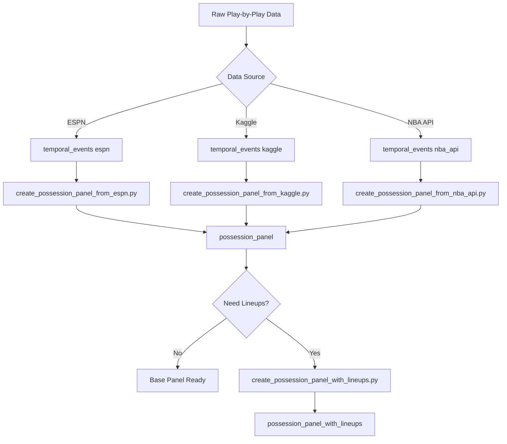

# Workflow #39: Possession Panel Data Pipelines

**Purpose:** Document the complete possession panel creation system including data sources, scripts, and current status

**When to Run:** When working with possession-level panel data for ML/simulation

**Status:** ✅ PRODUCTION - 3.8M base possessions + 229K with lineups

---

## Overview

The possession panel system transforms event-level play-by-play data into possession-level observations suitable for econometric ML models. This enables predicting possession outcomes (points scored) based on game state, lineups, and contextual features.

**Key Innovation:** Replicates pbpstats' lineup tracking logic without requiring the full pbpstats library, while maintaining flexibility to integrate multiple data sources.

---

## Current Database Status

### possession_panel (Base Table)
- **Total Possessions:** 3,801,927
- **Total Games:** 29,818
- **Date Range:** 1996-11-01 to 2023-06-09 (27 years)
- **Data Source:** ESPN (custom parser)
- **Metrics:**
  - Avg points/possession: 0.80
  - Scoring possession rate: 39.2%
  - Avg possession duration: 10.6 seconds

**Schema:**
```sql
possession_panel:
  - possession_id (PK)
  - game_id, possession_number (unique)
  - game_date, season, period
  - game_seconds_elapsed, seconds_remaining
  - offensive_team_id, defensive_team_id
  - points_scored, possession_result, possession_duration_seconds
  - score_differential, is_clutch
  - data_source, created_at, updated_at
```

### possession_panel_with_lineups (Enhanced Table)
- **Total Possessions:** 229,102
- **Total Games:** 974
- **Complete Lineups:** 220,947 (96.4% completion rate)
- **Has Offensive Players:** 223,259 (97.4%)
- **Has Defensive Players:** 229,102 (100%)

**Schema (adds to base):**
```sql
possession_panel_with_lineups:
  [... all base fields ...]
  - off_player_1_id through off_player_5_id (bigint)
  - off_lineup_hash (varchar)
  - def_player_1_id through def_player_5_id (bigint)
  - def_lineup_hash (varchar)
  - lineup_complete (boolean)
  - lineup_validation_notes (text)
  - lineup_participant_mismatch (boolean)
```

---

## Data Pipeline Scripts

### 1. Base Possession Panel Creators

#### `create_possession_panel_from_espn.py`
**Purpose:** Create possession panel from ESPN temporal events

**Features:**
- Detects possession changes via score changes, defensive rebounds, turnovers
- Calculates possession outcomes and duration
- Handles missing data gracefully
- No lineup tracking (base version)

**Usage:**
```bash
# Test mode
python scripts/etl/create_possession_panel_from_espn.py --limit 100

# Full run (processes all games in temporal_events table)
python scripts/etl/create_possession_panel_from_espn.py
```

**Possession Detection Logic:**
- Score changed → possession ended with points
- Defensive rebound → possession change
- Turnover → possession change
- End of quarter/period → possession ends

**Data Source:** `temporal_events` table (data_source = 'espn')

---

#### `create_possession_panel_from_kaggle.py`
**Purpose:** Create possession panel from Kaggle temporal events

**Features:**
- Similar detection logic to ESPN version
- Handles Kaggle-specific event formats
- Integrates with Kaggle data source

**Usage:**
```bash
python scripts/etl/create_possession_panel_from_kaggle.py --truncate --limit 3
```

**Data Source:** `temporal_events` table (data_source = 'kaggle')

---

#### `create_possession_panel_from_nba_api.py`
**Purpose:** Create possession panel from NBA API temporal events

**Features:**
- Processes official NBA API play-by-play
- Handles NBA API event types (EVENTMSGTYPE)
- More detailed event classification

**Data Source:** `temporal_events` table (data_source = 'nba_api')

---

### 2. Lineup-Enhanced Creators

#### `create_possession_panel_with_lineups.py` ⭐ PRIMARY
**Purpose:** Create possession panel with full 10-player lineup tracking (pb pstats-style)

**Key Innovation:** Replicates pbpstats' lineup tracking without requiring the library

**Features:**
1. **Starting Lineup Detection**
   - Loads official starters from box score START_POSITION field
   - Falls back to first 5 players with playing time if START_POSITION missing

2. **Substitution Tracking**
   - Monitors PLAYER1_ID (player out) and PLAYER2_ID (player in)
   - Updates lineup sets in real-time as events are processed
   - Maintains separate home/away lineup trackers

3. **Lineup Hashing**
   - Creates sortedplayer ID strings (e.g., "201142-201566-202326-202692-203081")
   - Enables quick lineup lookup and comparison
   - Matches pbpstats format for compatibility

4. **Validation**
   - Tracks lineup completeness (all 10 players present)
   - Flags participant mismatches
   - Logs validation notes for debugging

**Usage:**
```bash
# Test mode (3 games)
python scripts/etl/create_possession_panel_with_lineups.py --limit 3

# Full run
python scripts/etl/create_possession_panel_with_lineups.py
```

**LineupTracker Class:**
```python
class LineupTracker:
    def __init__(self, home_team_id, away_team_id)
    def process_substitution(event)  # Update lineups from sub events
    def set_starting_lineup(team_id, player_ids)  # Initialize starters
    def get_lineup(team_id)  # Returns [p1, p2, p3, p4, p5]
    def get_lineup_hash(team_id)  # Returns "p1-p2-p3-p4-p5"
```

**Data Source:** NBA API box scores + temporal events

---

#### `create_possession_panel_from_pbpstats.py`
**Purpose:** Direct integration with pbpstats library (if installed)

**Usage:**
```bash
pip install pbpstats  # If not already installed
python scripts/etl/create_possession_panel_from_pbpstats.py --limit 100
```

**Note:** This script uses the actual pbpstats library. The `with_lineups.py` version above replicates the same functionality without the dependency.

---

### 3. Supporting Scripts

#### `scrape_nba_lineups.py`
**Purpose:** Scrape official starting lineups from NBA.com

**Usage:**
```bash
python scripts/etl/scrape_nba_lineups.py --season 2023 --limit 100
```

**Output:** Box score files with START_POSITION data for lineup detection

---

#### `validate_lineup_tracking.py`
**Purpose:** Validate lineup tracking accuracy

**Checks:**
- Lineup completeness (all 10 players present)
- Participant mismatches (players in lineup but not in events)
- Substitution logic correctness
- Lineup hash consistency

**Usage:**
```bash
python scripts/etl/validate_lineup_tracking.py --game_id 0021900001
```

---

## Data Loading Scripts

### ESPN Events Loading

#### `extract_espn_local_to_temporal_UPDATED.py`
**Purpose:** Extract ESPN JSON files to temporal events CSV

**Status:** ✅ Complete - extracted 14.1M events from 44,826 games

**Output:** `/tmp/temporal_data_espn/temporal_events_espn.csv` (4.3 GB)

---

#### `load_espn_to_local_postgres.py`
**Purpose:** Load ESPN temporal events CSV to PostgreSQL

**Features:**
- Parses game clock ("11:38" → seconds)
- Reconstructs wall clock timestamps
- Batch loading (5,000 rows)
- Uses existing `temporal_events` table schema

**Usage:**
```bash
# Test (10K events)
python scripts/db/load_espn_to_local_postgres.py --test

# Full load (14.1M events)
python scripts/db/load_espn_to_local_postgres.py
```

**Status:** ✅ Tested - loaded 10K test events successfully

---

### hoopR Data Loading

#### `load_hoopr_to_local_postgres.py`
**Purpose:** Load hoopR Phase 1 data to PostgreSQL

**Data Categories:**
- Play-by-play (bulk_pbp/)
- Player box scores (bulk_player_box/)
- Team box scores (bulk_team_box/)
- Schedules (bulk_schedule/)
- League dashboards (player/team stats)
- 5-man lineups
- Standings

**Tables Created:**
- hoopr_play_by_play
- hoopr_player_box
- hoopr_team_box
- hoopr_schedule
- hoopr_league_player_stats
- hoopr_league_team_stats
- hoopr_lineups
- hoopr_standings

**Usage:**
```bash
# Test mode
python scripts/db/load_hoopr_to_local_postgres.py --test

# Full load
python scripts/db/load_hoopr_to_local_postgres.py
```

**Status:** ⏸️ Pending - schema mismatch issues to resolve

---

## Workflow Integration

### Standard Possession Panel Creation Flow



### Lineup-Enhanced Flow

```
1. Scrape/Load Box Scores
   ↓
2. Extract Starting Lineups (START_POSITION field)
   ↓
3. Load Temporal Events (play-by-play)
   ↓
4. Run create_possession_panel_with_lineups.py
   - Initialize LineupTracker with starters
   - Process each event:
     * Track substitutions
     * Update current lineups
     * When possession ends → save with 10 player IDs
   ↓
5. Output: possession_panel_with_lineups
   - 96.4% complete lineups
   - Ready for ML feature engineering
```

---

## Key Design Decisions

### Why Two Tables?

**possession_panel** (base):
- ✅ Faster to populate (no lineup tracking overhead)
- ✅ Works with any data source
- ✅ Good for basic analyses and testing
- ❌ Missing critical lineup information

**possession_panel_with_lineups** (enhanced):
- ✅ Complete 10-player tracking
- ✅ Enables lineup-based features (synergy, matchups)
- ✅ Matches pbpstats output format
- ❌ Requires box score data for starting lineups
- ❌ Slower to populate

**Recommendation:** Start with base panel for testing, use lineup version for production ML models.

---

### pbpstats Integration Strategy

**Approach:** Replicate key pbpstats functionality without full dependency

**Rationale:**
1. **pbpstats pros:**
   - Battle-tested lineup tracking
   - Handles edge cases (technical fouls, ejections)
   - Production-ready (powers pbpstats.com)

2. **pbpstats cons:**
   - External dependency
   - Limited to data.nba.com/stats.nba.com sources
   - Harder to customize for multi-source integration

3. **Our solution:**
   - Implement same `LineupTracker` logic
   - Support multiple data sources (ESPN, Kaggle, NBA API)
   - Maintain pbpstats compatibility (lineup hash format)
   - Option to use actual pbpstats if needed (via `create_possession_panel_from_pbpstats.py`)

---

## Next Steps for Enrichment

### Phase 1: Validate Current Data (1-2 days)
```bash
# Run validation on lineup panel
python scripts/etl/validate_lineup_tracking.py --sample 100

# Check data quality
psql -U ryanranft -d nba_simulator -c "
SELECT
    COUNT(*) FILTER (WHERE lineup_complete = false) as incomplete,
    COUNT(*) FILTER (WHERE lineup_participant_mismatch = true) as mismatches
FROM possession_panel_with_lineups;
"
```

### Phase 2: Load Full ESPN Data (2-3 hours)
```bash
# Load all 14.1M ESPN events
python scripts/db/load_espn_to_local_postgres.py

# Rebuild possession panel with full data
python scripts/etl/create_possession_panel_from_espn.py
```

### Phase 3: Add hoopR Data (1 day)
```bash
# Fix schema issues
# ... update hoopr loader ...

# Load hoopR data
python scripts/db/load_hoopr_to_local_postgres.py

# Create hoopR possession panel
python scripts/etl/create_possession_panel_from_nba_api.py
```

### Phase 4: Feature Enrichment (1-2 weeks)
Create enrichment scripts for:
- Venue features (elevation, attendance)
- Travel/fatigue (back-to-backs, miles traveled)
- Lagged features (previous possession outcomes)
- Lineup synergy (historical performance)
- Market data (betting lines)
- Momentum indicators

---

## Troubleshooting

### Issue: Low lineup completion rate
**Check:**
```sql
SELECT game_id, COUNT(*) as incomplete_possessions
FROM possession_panel_with_lineups
WHERE lineup_complete = false
GROUP BY game_id
ORDER BY incomplete_possessions DESC
LIMIT 10;
```

**Common Causes:**
- Missing starting lineup data (START_POSITION not populated)
- Substitution events not properly formatted
- Players ejected/injured mid-game

**Fix:** Review box score data quality, add fallback logic for starting lineups

---

### Issue: Participant mismatches
**Check:**
```sql
SELECT lineup_validation_notes, COUNT(*)
FROM possession_panel_with_lineups
WHERE lineup_participant_mismatch = true
GROUP BY lineup_validation_notes;
```

**Common Causes:**
- Player in lineup but didn't participate in possession
- Technical foul shooter not in regular lineup

**Fix:** Review LineupTracker logic for edge cases

---

## References

**Related Scripts:**
- `scripts/etl/create_possession_panel_*.py` (5 variants)
- `scripts/etl/validate_lineup_tracking.py`
- `scripts/db/load_*_to_local_postgres.py`

**Related Documentation:**
- pbpstats library: https://github.com/dblackrun/pbpstats
- NBA API documentation: https://github.com/swar/nba_api
- Panel data methodology: Your analysis doc (attached to this workflow)

**Database Tables:**
- possession_panel
- possession_panel_with_lineups
- temporal_events
- hoopr_* tables

---

*Last updated: October 7, 2025*
*Status: Production - 3.8M base possessions + 229K with lineups*
